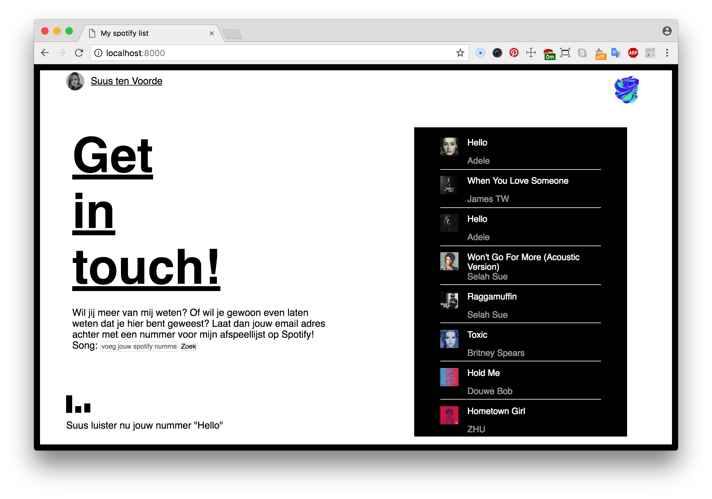
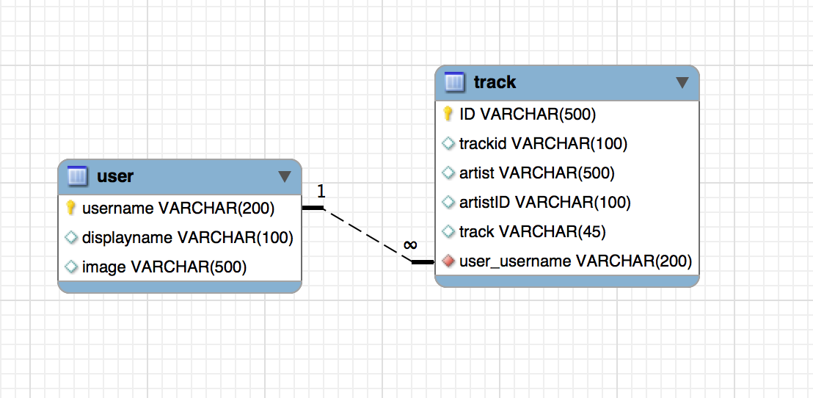

# Real-time Spotify Contact page

For my portfolio website I wanted to create a unique contact form. My idea is that users can add songs to the same playlist on the same time. When the owner of the playlist (me in this case) will listen to your added song, you will receive a message.

Because you need to search in the Spotify library, you need to have a Spotify premium account.



## How to install
First of all, download or clone the project, navigate to the root folder and install dependencies.

`npm install`

Run `npm start` to start the server on port 8000.

Create a `.env` file with the following values.

To fill in this values, you have to create a Spotify Developer account on [this website](https://beta.developer.spotify.com/):
- CLIENT_SECRET
- CLIENT_ID
- REDIRECT

Your Spotify details:
- PLAYLIST_ID
- USERNAME

Fill in a password for the AOUTH check:
- PASSPORT_SECRET

You have to create a MYSQL database as well, please fill in a password and host below:
- PASSPORT_DATABASE (it is a typo, please fill in a password for the database)
- HOST

## Project information
So as you have read before, I'm using the Spotify Web Api. For this project I have used the node wrapper spotify-web-api-node package. If you wanna know more about rate-limit issues for Spotify, check this [documentation](https://beta.developer.spotify.com/documentation/web-api/).

I had in mind to use the Last.fm api as well, but I figured it out with the Spotify API.

## Authorization
If you are using functionalities of the Spotify Web API, your user must to be authorized. This process could be hard to set up, that is way I have chosen to use [Passport-Spotify](https://github.com/jmperez/passport-spotify#readme). By plugging into Passport, Spotify authentication can be easily and unobtrusively integrated into any application or framework that supports Connect-style middleware, including Express.

## Database
For this application I have chosen to use a MYSQL database. This because I want to be secure with the data I'm getting from the Spotify API and don't want to lose it any time. To make this decision I have read multiple articles you can find below this README.md page. Furthermore, I created to two tables who have a connection with each other. When a user logs in, the data will be stored in the database. The username, display name, image and the email will be saved in the user table. When a user have searched for a track and clicked on the add button, that track will be saved in the database as well. The relation between the user and the track is a one to many. One track can have one specific user, but a user can add multiple tracks.



## Data life cycle
<!-- Include the sketch you made in class and describe what the real-time aspect of your project will entail. -->


## Socket.io
For making this application real-time, I used socket.io to communicate between the server and the client.

This happens when a user adds a track. When the user add a track to the playlist, the track will be added to the database and the client side will update the playlist.

Furthermore, Spotify has the function `getMyCurrentPlaybackState()` which shows you if the user is currently listening to music. By polling this function every second, the client side will show the results.


## Offline
To check the online status of the browser, I'm using `navigator.online`. Browsers implement this property differently. In Chrome and Safari, if the browser is not able to connect to a local area network (LAN) or a router, it is offline. In Firefox and Internet Explorer, switching the browser to offline mode sends a false value. Because I want to see the changes in the network state, I'm using addEventListener to listen for the events on window.ononline and window.onoffline.

```javascript
var errorMessage = document.querySelector('.offline');

if (navigator.onLine) {
	errorMessage.classList.remove('active');
} else {
	errorMessage.classList.add('active');
}

window.addEventListener("offline", function(e) {
	errorMessage.classList.add('active');
}, false);

window.addEventListener("online", function(e) {
	errorMessage.classList.remove('active');
}, false);
```

To check if the server is offline or the internet connection is down:

``` javascript
socket.on('disconnect', function() {
	console.log('disconnect..');
	errorMessage.innerHTML = "Your server is offline, or your WiFi is down";
	errorMessage.classList.add('active');
});
```

## Tooling
- [x] Server: express
- [x] Templating: ejs
- [x] Real-time: socket.io
- [x] Bundle: Browserify

## Features
- [x] Login with your spotify (premium) account
- [x] Search for a song in the spotify library
- [x] Add tracks to a public playlist
- [x] See if somebody is adding new tracks to the playlist
- [x] Find out of Suus is listening to music at that moment
- [x] Find out if Suus is listening to the song you have added
- [ ] You will receive an email when Suus have played your song
- [ ] You are able to follow this public playlist on spotify
- [ ] You can listen to the songs in the browser (real-time)

## Process

> Note that, when using the Web API, only the owner of a collaborative playlist can make changes to that playlist.

NOOOO, WHY?

> We only allow users to add songs to their own playlists, because if collaborative playlists were open to the world, API consumers would be able to search for collaborative playlists and add whatever songs they wanted to any playlist. Until we solve the problem of permissions delegation in a satisfactory manner, we won't implement this feature - so don't expect it in the short term.

After I found out that my idea couldn't work that way, I started to think about another solution. From there on, I created a MYSQL database where I stored the data. From there on, I created a playlist and pushed it to my Spotify playlist on my own user account.

## Sources
https://blog.cloud66.com/3-tips-for-selecting-the-right-database-for-your-app/
https://firebearstudio.com/blog/node-js-database.html
https://www.npmjs.com/package/mysql
https://medium.com/@eligijuskrepsta/setting-up-node-mysql-and-nginx-on-digital-ocean-247546be20df
https://github.com/dwyl/how-to-choose-a-database

MYSQL problem:
https://stackoverflow.com/questions/49194719/authentication-plugin-caching-sha2-password-cannot-be-loaded
